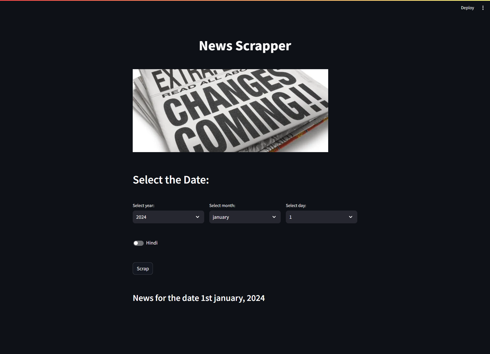

# News Scraper

[Link to the website](https://news-scraper.streamlit.app)

This Python code defines a Streamlit web app for scraping news articles from a specific website based on user-selected date parameters. The app includes input fields for choosing the ``year``, ``month``, and ``day`` of the news, along with an option to toggle between English and Hindi ``languages``. Users can click a "Scrap" button to initiate the scraping process.

Upon clicking the "Scrap" button, the code sends a ``request`` to the specified website, extracts news articles using ``BeautifulSoup``, and displays them in a Streamlit interface. Each news article is presented in a stylized box with a clickable link to the original article. The app provides a visual representation of the scraped news for the selected date.

Note: The website URL used for scraping is specific to [News Website](https://sarkaripariksha.com/gk-and-current-affairs/), and the structure of the HTML elements is assumed to remain consistent for successful scraping.

-----

## Installation

```
pip install streamlit
```
```
pip install beautifulsoup4
```
```
pip install requests
```
Firstly import the `streamlit`, `beautifulsoup4` and `requests` libraries through the terminal that will help in the program.

-----

## How to run:

Download the zip file and extract the files. Then open your terminal or command prompt, navigate to the directory where the `main.py` python file is saved, and run the following command:

```
streamlit run main.py
```

-----

## Aim of the Project:

1. **News Scraping:** Extract news articles from a specific website based on user-selected date parameters.
2. **User Interaction:** Provide a user-friendly interface using Streamlit for users to input the desired date and language preferences.
3. **Visualization:** Display the scraped news articles in a visually appealing format with clickable links.

-----

## Advantages:

1. **Customized News Retrieval:** Users can select a specific date to retrieve news articles, allowing for historical news exploration.
2. **Language Flexibility:** The option to toggle between English and Hindi caters to a diverse user base.
3. **Interactive Interface:** Streamlit's interactive elements enhance user experience, making the news retrieval process engaging.

-----

## Limitations and Disadvantages:

1. **Website Dependency:** The scraping process is sensitive to changes in the target website's HTML structure, requiring frequent updates to maintain functionality.

2. **Legal and Ethical Concerns:** Web scraping may violate terms of service and raise ethical questions, necessitating permission from website owners and adherence to legal standards.

3. **Data Accuracy Challenges:** The accuracy of scraped data is contingent on consistent formatting on the website; unexpected changes can result in inaccurate or incomplete information extraction.

4. **Limited Language Support:** While English and Hindi are supported, the project may not accommodate all languages, potentially limiting user accessibility.

-----

## Future Improvements:

1. **Dynamic Content Handling:** Implement a solution to handle websites with dynamic content loaded via JavaScript, ensuring comprehensive scraping for a wider range of websites.

2. **Error Handling and User Feedback:** Enhance the user interface with error handling mechanisms to provide informative feedback in case of scraping failures or issues, improving user experience.

3. **Multi-Website Support:** Extend the application to support scraping from multiple news websites with different structures, allowing users to choose their preferred news sources.

4. **Advanced Language Options:** Incorporate language detection mechanisms to dynamically identify and support a broader range of languages, providing a more inclusive language selection for users.

5. **Caching Mechanism:** Implement a caching mechanism to store previously scraped data, reducing the need for redundant requests and improving overall application performance.

-----

## Technologies Learned:
1. **Streamlit:** Used for building interactive web applications with minimal code.
2. **BeautifulSoup:** Employed for web scraping, extracting structured data from HTML and XML files.
3. **Requests:** Utilized for sending HTTP requests to the specified website to fetch web pages.
4. **HTML/CSS Styling:** Applied to enhance the visual presentation of scraped news articles in the Streamlit app.
5. **Python:** The primary programming language for building the entire application.

This project provides hands-on experience in web scraping, web development, and data visualization, making it a valuable learning opportunity for Python developers interested in these domains.

-----

## Output:



-----
